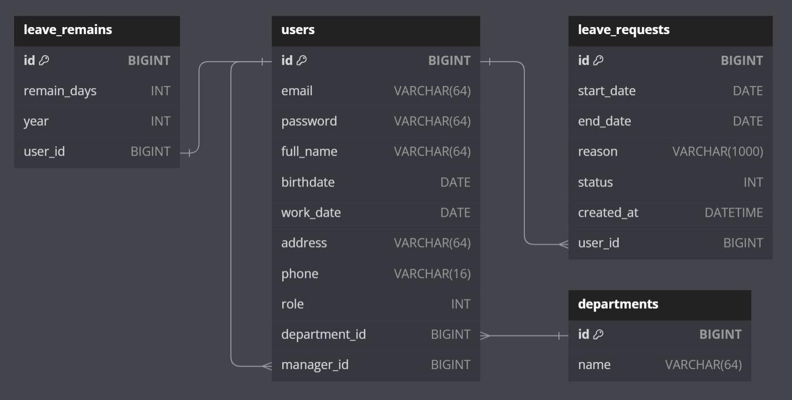
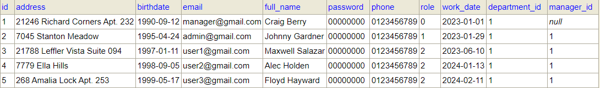
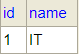
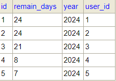
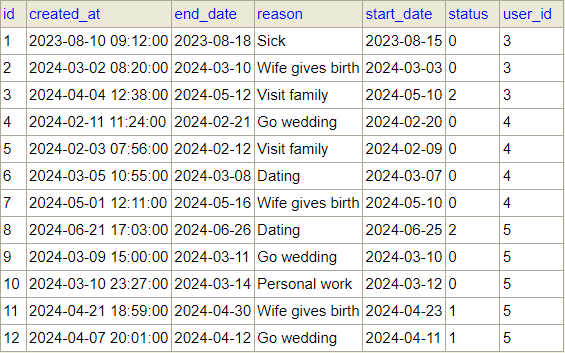

A Spring Boot project that manage employee day offs.

Run: `java -jar back-end-day-off-0.0.1-SNAPSHOT.jar`

Database console: http://localhost:8080/h2-console

- Driver Class: `org.h2.Driver`
- JDBC URL: `jdbc:h2:mem:dacnpm`
- User Name: `sa`
- Password:

### Database Schema

`role`

- 0 - Manager
- 1 - Admin
- 2 - User

`status`

- 0 - Accepted
- 1 - Rejected
- 2 - Waiting

#### Sample data

**Users**

**Departments**

**LeaveRemains**

**LeaveRequests**

